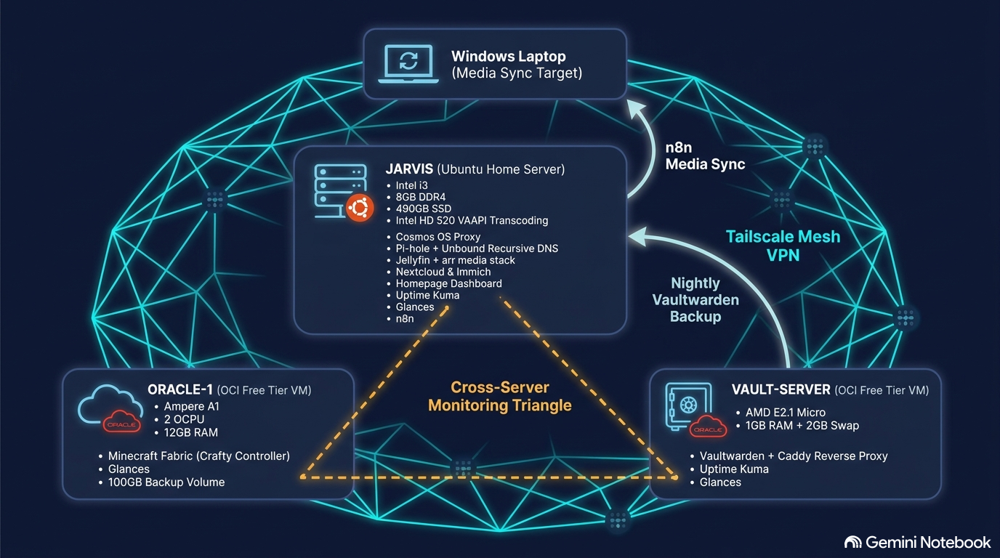
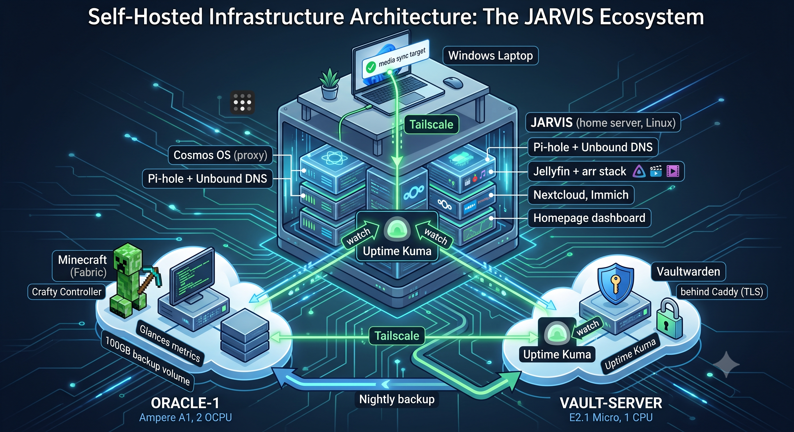
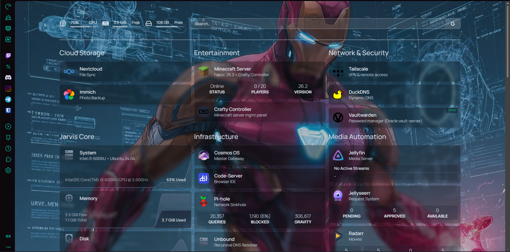
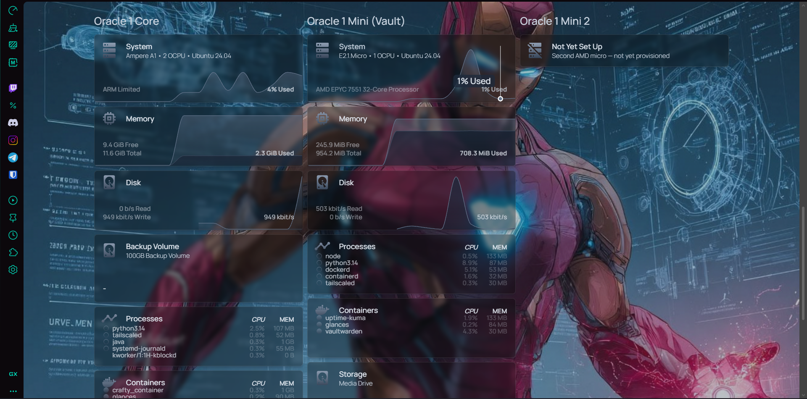
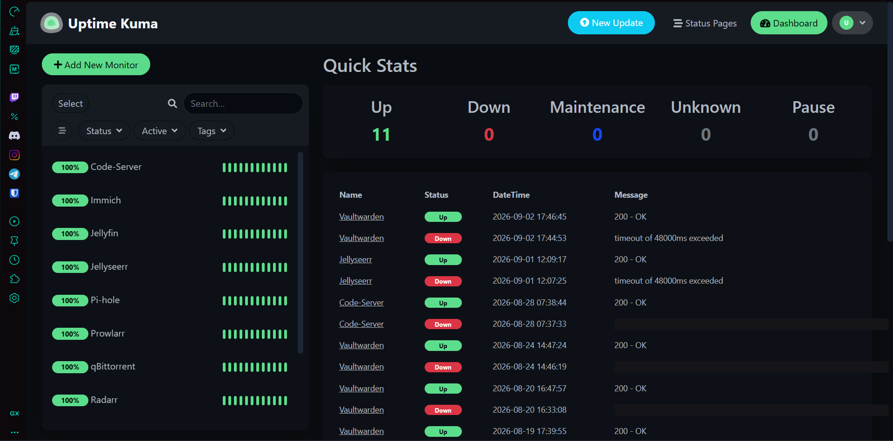
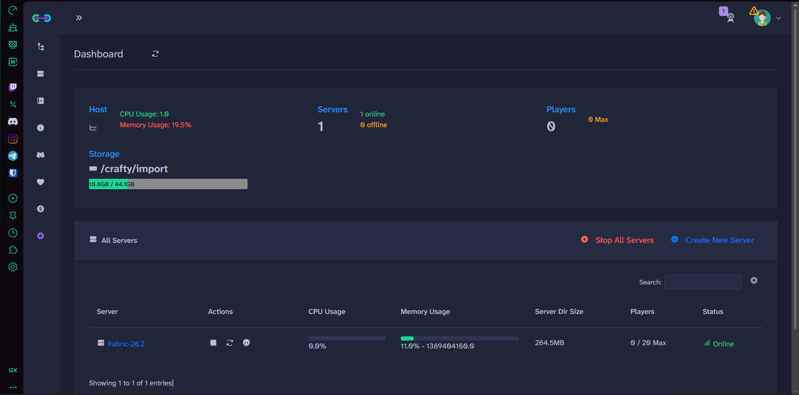
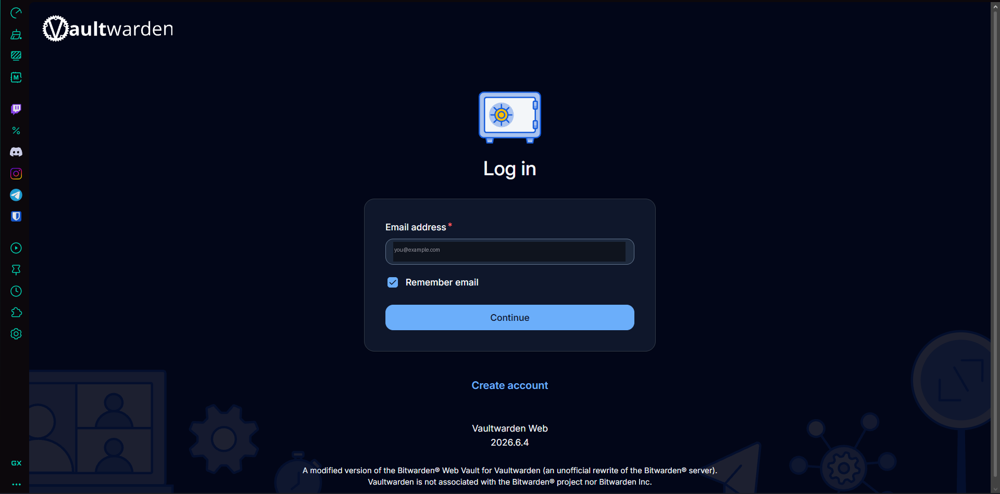

# Homelab Infrastructure

A three-server self-hosted infrastructure project: a repurposed-laptop home server, and two Oracle Cloud Always Free instances, tied together with Tailscale, cross-server monitoring, and automated encrypted backups.

Infrastructure built and run continuously since May 2026. This repository was published in September from live configs and server notes; commit dates reconstruct the build timeline.

---

## Architecture

Alternate view

Three independent Uptime Kuma-style watchers form a monitoring triangle — no single server is responsible for reporting its own downtime, which closes a gap that a naive "monitor everything from one dashboard" setup has.

---

## What's in this repo

| Folder | Contents |
|---|---|
| [`jarvis/`](./jarvis) | Home server: Homepage dashboard config, custom CSS, sync automation, and container definitions for every hosted service |
| [`oracle-1/`](./oracle-1) | Minecraft server backup automation |
| [`vault-server/`](./vault-server) | Caddy reverse proxy config, Vaultwarden backup automation |
| [`docs/`](./docs) | Architecture write-ups per server — the reasoning behind key decisions, not just a config dump |

All IPs, domains, tokens, and API keys throughout this repo are placeholders (e.g. `<JARVIS_TAILSCALE_IP>`). Real values are kept in a private, local-only copy.

---

## Screenshots

> Real IPs, domains, and personal info have been cropped or redacted from all screenshots below.

**Homepage dashboard** — live metrics and service status across all three servers

**Uptime Kuma** — the cross-server monitoring triangle in action

**Crafty Controller** — Minecraft server management panel

**Vaultwarden** — self-hosted password manager, live behind Caddy/TLS

---

## Notable design decisions

**Isolating the password manager.** Vaultwarden started out running alongside everything else on Jarvis. It was later migrated to its own dedicated, minimal Oracle instance — so a media server restart, a bad Docker update, or any other Jarvis-side issue can never take the password manager down with it. See [`docs/vault-server-reference.md`](./docs/vault-server-reference.md).

**Cross-server monitoring instead of a single dashboard.** A single Uptime Kuma instance can't alert you if the server it's running on is the one that goes down. Splitting monitoring across three independent instances, each watching the other two, means at least one always survives to raise the alarm.

**Recursive DNS over upstream resolvers.** Unbound queries root DNS servers directly rather than forwarding to Google or Cloudflare, with Pi-hole layered on top for ad-blocking — a deliberate privacy/control tradeoff over the simpler "just use 1.1.1.1" approach.

**Crafty Controller over bare systemd.** The Minecraft server initially ran as a direct systemd service. Migrating it under Crafty Controller (a Dockerized management panel) made mod installation, whitelist changes, and console access possible without SSH for routine tasks — meaningfully lowering day-to-day maintenance friction.

**Automated, redundant backups.** Both the Minecraft world/mods and the Vaultwarden vault back up automatically on a schedule, with the Vaultwarden backup specifically pushed to a *different physical server* over Tailscale — protecting against loss of an entire Oracle account or region, not just a single service crashing.

---

## Stack

**Networking:** Tailscale (mesh VPN, MagicDNS), Cosmos OS (reverse proxy + Let's Encrypt), Caddy (reverse proxy + automatic TLS), DuckDNS (dynamic DNS), Pi-hole + Unbound (DNS filtering + recursive resolution)

**Media:** Jellyfin (VAAPI hardware transcoding), Radarr, Sonarr (dual-instance TV/Anime), Prowlarr, qBittorrent, Jellyseerr, FlareSolverr

**Infrastructure:** Docker, Homepage (dashboard), Uptime Kuma (monitoring), Glances (metrics), n8n (automation), Code-Server

**Storage:** Nextcloud, Immich, Vaultwarden

**Cloud:** Oracle Cloud Always Free tier (Ampere A1 + 2× AMD Micro instances)

---

## Further reading

- [Jarvis (home server) architecture](./docs/jarvis-reference.md)
- [Oracle-1 (Minecraft) architecture](./docs/oracle-1-reference.md)
- [Vault-server architecture](./docs/vault-server-reference.md)
